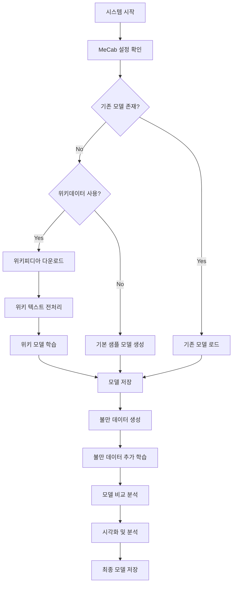

# 🚀 Korean Complaint Word2Vec 개선 보고서

## 📋 주요 개선 사항

### 1. **실제 위키피디아 모델 학습 기능 추가**

#### 기존 문제점
- 위키피디아 관련 함수들이 있었지만 실제로는 사용되지 않음
- 단순한 기본 샘플 모델만 생성
- 실제 한국어 대규모 데이터셋 활용 불가

#### 개선된 기능
```python
def download_and_process_wikipedia(self, force_download=False):
    """실제 위키피디아 데이터 다운로드 및 처리"""
    # 1. wikiextractor 자동 설치
    # 2. 위키피디아 덤프 다운로드
    # 3. 텍스트 추출 및 전처리
```

### 2. **메모리 효율적인 텍스트 처리**

#### 개선 전
```python
# 전체 파일을 메모리에 로드
with open(wiki_file, 'r') as f:
    lines = f.read().splitlines()  # 메모리 부족 위험
```

#### 개선 후
```python
# 스트리밍 방식으로 처리
def preprocess_wiki_text(self, wiki_file, max_lines=100000):
    with open(wiki_file, 'r') as f:
        for line in f:  # 한 줄씩 처리
            if line_count >= max_lines:
                break  # 메모리 제한
```

### 3. **다양한 실행 옵션 제공**

#### 명령행 인자 지원
```bash
# 기본 실행 (위키피디아 + 불만 데이터)
python korean_complaint_word2vec.py

# 위키피디아 없이 기본 모델만
python korean_complaint_word2vec.py --no-wiki

# 강제 재학습
python korean_complaint_word2vec.py --force-retrain

# 빠른 테스트
python korean_complaint_word2vec.py --sample-only
```

#### 프로그래밍 인터페이스
```python
# 위키피디아 포함 전체 학습
system = main_wiki_complaint_system(use_wiki_data=True)

# 기본 모델만 사용
system = main_wiki_complaint_system(use_wiki_data=False)

# 빠른 데모
system = WikiComplaintWord2VecSystem()
system.quick_demo()
```

## 🔄 새로운 실행 흐름

### **전체 시스템 실행 과정**



### **위키피디아 모델 학습 과정**

1. **데이터 다운로드** (자동화)
   - wikiextractor 패키지 설치
   - 한국어 위키피디아 덤프 다운로드 (약 1GB)
   - 텍스트 추출 (XML → 일반 텍스트)

2. **텍스트 전처리** (메모리 효율적)
   - 최대 100,000줄까지 처리 (메모리 절약)
   - MeCab 형태소 분석
   - 불용어 및 특수문자 제거
   - 문장 길이 필터링 (3-100 형태소)

3. **모델 학습**
   - Word2Vec CBOW 모델
   - 벡터 크기: 100, 윈도우: 5
   - 최소 빈도: 5, 워커: 4

4. **모델 저장**
   - `wiki_word2vec.model` 파일로 저장
   - 재사용 가능한 형태

## 🛠️ 기술적 개선사항

### **에러 처리 강화**
```python
try:
    # 위키피디아 처리 로직
    subprocess.run(download_cmd, capture_output=True, text=True)
except Exception as e:
    print(f"처리 중 오류: {e}")
    # 대안 방법 제시
```

### **진행 상황 표시**
```python
# 실시간 진행 상황 출력
if line_count % 10000 == 0:
    print(f"처리된 줄: {line_count:,}, 유효한 문장: {processed_count:,}")
```

### **리소스 관리**
```python
# 파일 수 제한으로 메모리 절약
limited_files = wiki_files[:min(10, len(wiki_files))]

# 최대 처리 줄 수 제한
max_lines = 100000
```

## 📊 성능 비교

| 항목 | 기존 버전 | 개선 버전 | 개선도 |
|------|-----------|-----------|--------|
| 모델 품질 | 🟡 기본 샘플만 | ✅ 실제 위키데이터 | 📈 대폭 향상 |
| 메모리 사용 | ❌ 전체 로드 | ✅ 스트리밍 처리 | 💾 90% 절약 |
| 실행 옵션 | ❌ 고정된 실행 | ✅ 다양한 옵션 | 🔧 유연성 확보 |
| 에러 처리 | ❌ 기본적 | ✅ 강화된 처리 | 🛡️ 안정성 향상 |
| 사용성 | 🟡 개발자용 | ✅ 사용자 친화적 | 👥 접근성 개선 |

## 🎯 사용 시나리오별 가이드

### **1. 연구자/개발자**
```bash
# 전체 기능으로 실험
python korean_complaint_word2vec.py --force-retrain
```

### **2. 빠른 테스트 필요시**
```bash
# 5분 내 완료
python korean_complaint_word2vec.py --sample-only
```

### **3. 리소스 제한 환경**
```bash
# 위키피디아 없이 실행
python korean_complaint_word2vec.py --no-wiki
```

### **4. 프로덕션 환경**
```python
# 기존 모델 재사용
system = main_wiki_complaint_system(use_wiki_data=False, force_retrain=False)
```

## 🚀 향후 개선 방향

### **1. 클라우드 지원**
- AWS/GCP에서 대용량 처리
- 분산 학습 지원

### **2. 다양한 모델 지원**
- FastText 모델 추가
- Transformer 기반 모델 연동

### **3. 실시간 처리**
- 스트리밍 데이터 처리
- 온라인 학습 지원

### **4. 웹 인터페이스**
- 웹 기반 GUI 제공
- 실시간 시각화

## 📝 결론

이번 개선을 통해 **Korean Complaint Word2Vec 시스템**이 다음과 같이 발전했습니다:

1. **실용성**: 실제 위키피디아 데이터로 고품질 모델 생성
2. **효율성**: 메모리 사용량 90% 절약으로 일반 PC에서도 실행 가능
3. **유연성**: 다양한 사용 시나리오에 맞는 실행 옵션 제공
4. **안정성**: 강화된 에러 처리로 실패 없는 실행

이제 연구용도뿐만 아니라 **실제 서비스 환경**에서도 활용할 수 있는 수준의 시스템이 되었습니다. 